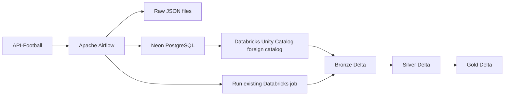

# Football Fixtures Data Pipeline

An end-to-end data engineering project that collects football fixtures from API-Football, loads them into Neon PostgreSQL with Apache Airflow, and builds Bronze, Silver, and Gold Delta tables in Databricks.

The project demonstrates API ingestion, incremental database loading, workflow orchestration, PostgreSQL federation, Spark transformations, data quality checks, and Git-based Databricks jobs.

## Architecture



Airflow runs the ingestion tasks and then triggers an existing Databricks job. The Databricks job reads the Neon source through a Unity Catalog foreign catalog and runs the Bronze, Silver, Gold, and data quality tasks.

## Pipeline flow

1. Airflow fetches fixture data from API-Football for the dates selected by the DAG.
2. The raw API responses are saved as JSON files.
3. Airflow loads the fetched data into the `football.fixtures` table in Neon PostgreSQL.
4. Airflow triggers the configured Databricks job using `DatabricksRunNowOperator`.
5. Databricks reads the PostgreSQL source through Unity Catalog and runs the lakehouse tasks.
6. Data quality tasks validate the Bronze, Silver, and Gold outputs.

The DAG is configured to run daily at 03:00 in the `Asia/Baku` timezone. Check `dags/football_fixtures_dag.py` for the current schedule and date-selection logic.

## Data layers

- **Bronze** — Copies fixture data from Neon PostgreSQL into a Delta table and merges new or updated records.
- **Silver** — Cleans and standardizes fixture data using PySpark.
- **Gold** — Creates daily league-level summaries using Spark SQL.

## Technology stack

- Python
- Apache Airflow
- Docker Compose
- PostgreSQL / Neon
- Databricks
- Unity Catalog
- PySpark
- Spark SQL
- Delta Lake
- API-Football

## Repository structure

```text
.
├── config/
├── dags/
│   └── football_fixtures_dag.py
├── data/
│   └── raw/
├── databricks/
│   ├── notebooks/
│   │   ├── bronze/
│   │   │   └── 01_bronze_fixtures.sql
│   │   ├── silver/
│   │   │   └── 01_silver_fixtures.py
│   │   └── gold/
│   │       └── 01_gold_summary.py
│   └── tests/
│       ├── bronze/
│       ├── silver/
│       └── gold/
├── sql/
│   └── postgres/
│       └── 001_create_fixtures.sql
├── src/
│   └── football_pipeline/
├── tests/
├── Dockerfile
├── docker-compose.yaml
├── requirements.txt
└── README.md
```

## Prerequisites

- Docker Desktop with Docker Compose
- An API-Football API key
- A Neon PostgreSQL database
- A Databricks workspace with permission to use or create the required Unity Catalog objects
- A Databricks job configured to use this repository's Git source

## Local configuration

Create a `.env` file in the project root and set:

```dotenv
API_FOOTBALL_KEY=your_api_football_key
DATABASE_URL=your_neon_postgresql_connection_string
```

Use the Neon connection string for your database. Keep real credentials in your local `.env` file; never commit `.env`, API keys, database URLs, access tokens, or passwords to Git.

The PostgreSQL schema is defined in:

```text
sql/postgres/001_create_fixtures.sql
```

Apply this schema to the Neon database before the first pipeline run if it has not already been created.

## Run Airflow locally

From the project root, build the image and start the services:

```bash
docker compose up -d --build
```

Open the Airflow UI:

```text
http://localhost:8080
```

Trigger the `football_fixtures_to_neon` DAG and check that its tasks complete successfully.

To stop the services:

```bash
docker compose down
```

## Configure the Airflow–Databricks connection

Create an Airflow connection for Databricks:

1. Open **Admin → Connections** in the Airflow UI.
2. Set **Connection ID** to `databricks_default`.
3. Set **Connection Type** to `Databricks`.
4. Set **Host** to your Databricks workspace URL, for example:
   `https://<your-workspace-host>`
5. For Personal Access Token authentication, leave **Login** empty or set it to `token`.
6. Put the token in the **Password** field and save the connection.

Do not put the token in the connection description, DAG code, README, or GitHub.

The DAG uses this connection to trigger the Databricks job. The job ID is configured in `dags/football_fixtures_dag.py`; update it if you use a different Databricks job.

## Configure the Databricks job

Create or configure the Databricks job in your workspace:

- Use the Git provider as the job source and select the repository's `main` branch.
- Add the Bronze, Bronze quality, Silver, Silver quality, Gold, and Gold quality tasks.
- Configure task dependencies so each quality check follows its transformation.
- Make sure the job can access the Neon PostgreSQL foreign catalog in Unity Catalog.
- Ensure the job's notebook paths match the files in this repository.

The Airflow DAG triggers this existing job; it does not create the Databricks job, Git connection, Unity Catalog connection, or foreign catalog on each run. These resources are configured in their respective services.

The Neon PostgreSQL connection, foreign catalog, credentials, and required permissions are environment-specific and are not stored in this repository.

## Run notebooks manually

Manual notebook runs are useful for debugging or validating an individual layer. Run them in this order:

1. `databricks/notebooks/bronze/01_bronze_fixtures.sql`
2. `databricks/notebooks/silver/01_silver_fixtures.py`
3. `databricks/notebooks/gold/01_gold_summary.py`

For the normal end-to-end workflow, trigger the Airflow DAG. Airflow loads the source data and then starts the configured Databricks job.

## Data quality checks

After a successful run, verify that:

- `fixture_id` is populated and unique.
- `fixture_date` is populated.
- Bronze and Neon record counts are consistent.
- Silver contains the expected cleaned fixture records.
- Gold summaries contain sensible match and goal totals.

## Security notes

- Do not commit `.env`, API keys, database URLs, access tokens, or passwords.
- Keep local raw data and logs out of Git unless a small sanitized sample is intentionally added.
- Store Databricks credentials in Airflow connections or an appropriate secrets backend.
- Grant Databricks connection and catalog access only to users and service identities that need it.
- For production use, prefer managed identity or service-principal authentication and a managed secrets solution over a personal access token.